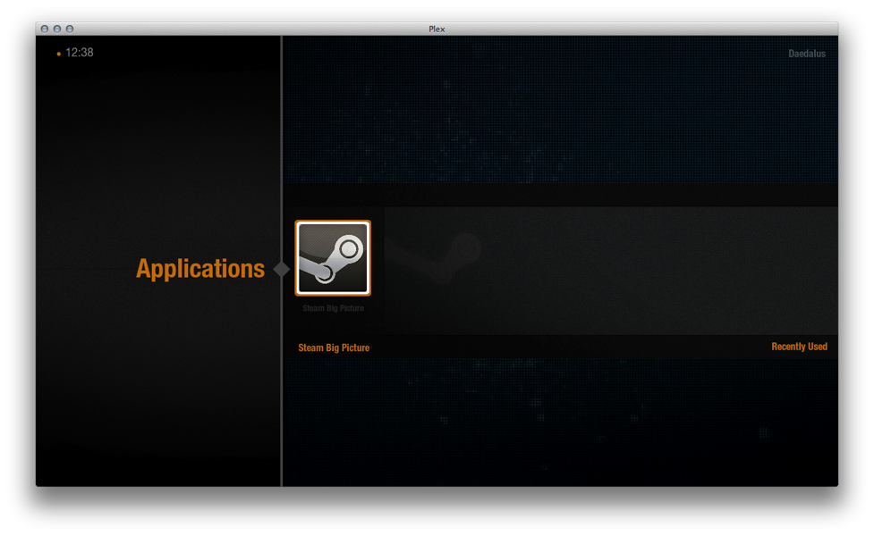

# SteamTV

Launch [Steam Big Picture Mode](http://store.steampowered.com/bigpicture/) directly from [Plex](http://www.plexapp.com).

For OS X and Linux.

## Notes

This requires a local Plex Media Server. It can be perfectly empty but for this plug-in and it will not interfere with other servers.
No configuration is necessary beyond installing the plug-in.

## Installation

1. Install Plex Media Server and run it under the same user session as the Plex Home Theater client
2. Rename repository folder or duplicate thereof to `SteamPlex.bundle`
3. Copy to `~/Library/Application Support/Plex Media Server/Plugins`
4. Launch it from the Application menu item in Plex
5. Wait a while for Big Picture Mode to launch, it's kinda slow to get started

## Screenshot

## Note for Linux users

Once PMS is installed, stop it, disable its init script and launch it using your sessions manager. The executable is "start_pms".
